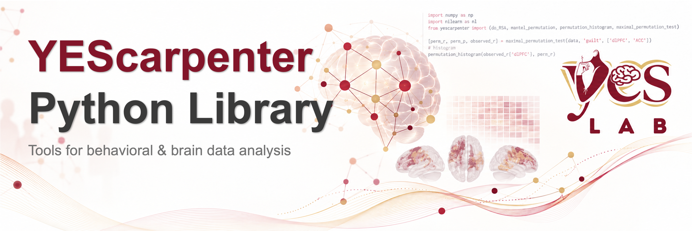

# yescarpenter


Frequently used data-analysis functions for [YESlab](https://yeslab.psych.ucsb.edu/) members and other social neuroscience researchers, including:
1. principal component analysis with visualization and 
2. representational similarity analysis (RSA) with data-cleaning helpers

Full documentation, with the parameters and caveats of every function, lives in the
[`docs/`](docs/index.md) folder and is built with MkDocs (see [Documentation](#documentation)).

## Installation

```bash
pip install yescarpenter
```

To install from source instead:

```bash
git clone https://github.com/shangchengzhao/yescarpenter.git
cd yescarpenter
pip install -e .
```

Requires Python 3.6+. Dependencies (numpy, pandas, scipy, scikit-learn, statsmodels,
matplotlib, seaborn) are installed automatically.

## What it does

| Area | Functions |
| --- | --- |
| **PCA** | `perform_pca`, `scree_plot`, `create_scree_plot`, `pc_plot` |
| **Building RDMs** | `construct_RDM`, `draw_heatmap`, `get_triangular_matrix`, `standardize_rdms`, `shuffle_rdm` |
| **RSA and permutation tests** | `do_RSA`, `mantel_permutation`, `permutation_histogram`, `maximal_permutation_test` |
| **Variance partitioning** | `variance_partitioning`, `calculate_r_squared_loss` |
| **Data utilities** | `align_data`, `clean_data_df`, `clean_data_np` |

Everything is importable from the top level: `from yescarpenter import perform_pca`.

## Walkthrough

### PCA

```python
import numpy as np
import pandas as pd
from yescarpenter import create_scree_plot, perform_pca, pc_plot

traits = pd.DataFrame(np.random.default_rng(0).normal(size=(100, 6)),
                      columns=["warm", "kind", "smart", "skilled", "bold", "loud"])

create_scree_plot(traits, max_components=5)                      # choose how many to keep
loadings, explained_variance, scores = perform_pca(traits, n_components=2)
pc_plot(loadings, traits)                                        # one bar chart per component
```

`perform_pca` z-scores the data, runs PCA and applies a varimax rotation. Loadings,
scores and explained variance all describe the rotated components. `create_scree_plot`
plots the unrotated spectrum.

### Representational similarity analysis

```python
import numpy as np
from yescarpenter import construct_RDM, do_RSA

rng = np.random.default_rng(1)
ratings = rng.normal(size=(20, 8))                        # 20 items x 8 ratings
model = ratings + rng.normal(scale=0.5, size=(20, 8))     # 20 items x 8 model features

rdm_ratings = construct_RDM(ratings, method="euclidean", draw=False)
rdm_model = construct_RDM(model, method="cosine", draw=False)

perm_r, observed_r, p = do_RSA(rdm_ratings, rdm_model, n_permutations=1000, random_state=42)
print(f"r = {observed_r:.3f}, p = {p:.4f}")
```

`do_RSA` correlates the two RDMs (Spearman) and tests the correlation with a Mantel
permutation test. The p-value is **one-tailed**: it only tests for a positive
correspondence between the RDMs.

Other typical steps:

- **Different items or missing values in your sources?** Use `align_data` before building RDMs.
- **One variable compared against several related ones?** Use `maximal_permutation_test`
  for multiple-comparison-corrected p-values.
- **How much of one RDM does each predictor explain uniquely?** Use `variance_partitioning`.

## Documentation

The docs are a MkDocs site in `docs/`, configured by `mkdocs.yml`:

```bash
pip install -r docs/requirements.txt
mkdocs serve      # live preview at http://127.0.0.1:8000
```

## Tests

```bash
pip install pytest
pytest
```

## License

MIT. See [LICENSE](LICENSE).
